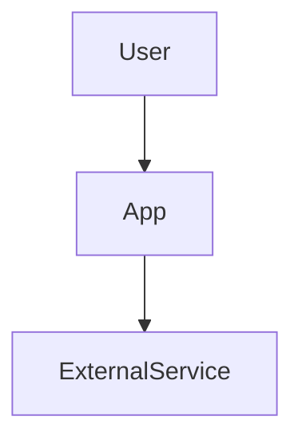
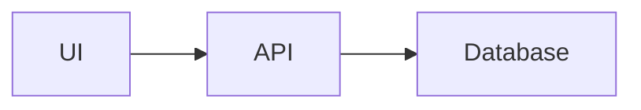
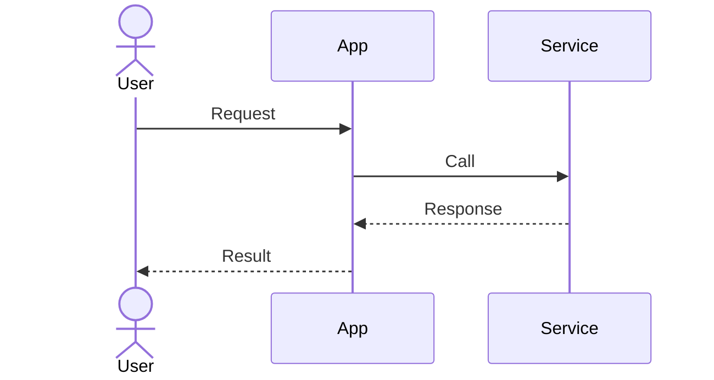
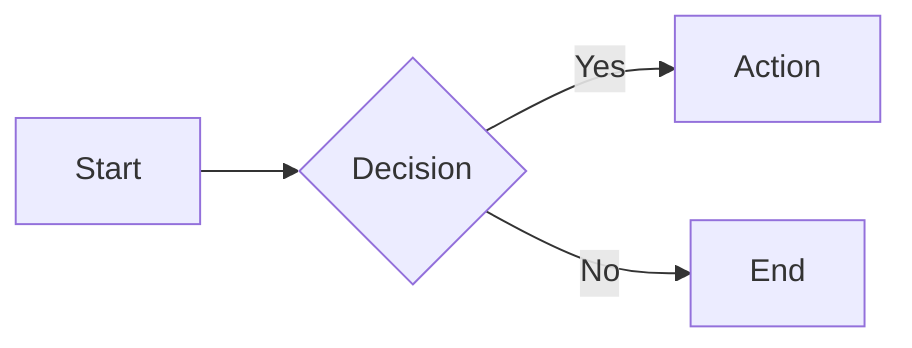
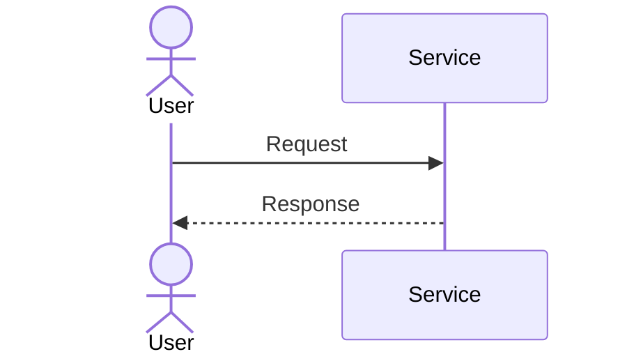

# Docs Architect

## Purpose

Create comprehensive functional and architecture documentation in `docs/` for a repository to aid understanding. Output is Markdown and includes Mermaid diagrams.

## When to use

Use this skill when the user requests:

- Functional documentation
- Architecture documentation
- Repository understanding / documentation
- Mermaid diagrams for the system

## Output location

- Write to `docs/` at the repository root.
- If `docs/` does not exist, create it.
- Prefer updating existing files over creating new ones when content already exists.

## Required files

Create or update these Markdown files:

- `docs/README.md`
- `docs/architecture.md`
- `docs/functional.md`
- `docs/diagrams.md`

---

## CRITICAL: Diagram Format Requirements

> **ALL DIAGRAMS MUST BE IN MERMAID FORMAT**

This is a mandatory requirement. Do NOT use:
- ASCII art diagrams
- Plain text box diagrams
- External image files for architecture/flow diagrams
- Any other diagram format

### Mermaid Syntax Rules

Every diagram MUST:
1. Be enclosed in a fenced code block with the `mermaid` language identifier
2. Use valid Mermaid syntax
3. Render correctly in GitHub, GitLab, and VS Code preview

### Required Mermaid Code Block Format

````markdown
```mermaid
<diagram-type>
  <diagram-content>
```
````

### Supported Mermaid Diagram Types

Use these Mermaid diagram types as appropriate:

| Diagram Type | Mermaid Keyword | Use Case |
|--------------|-----------------|----------|
| Flowchart | `flowchart TB/LR/TD` | System context, component diagrams, process flows |
| Sequence | `sequenceDiagram` | API calls, method interactions, request/response flows |
| State | `stateDiagram-v2` | State machines, lifecycle diagrams |
| Journey | `journey` | User journeys, experience maps |
| Class | `classDiagram` | Class relationships, data models |
| ER | `erDiagram` | Database schemas, entity relationships |
| Gantt | `gantt` | Project timelines (rarely needed) |
| Pie | `pie` | Distribution charts (rarely needed) |

### Minimum Diagrams Required

The `docs/diagrams.md` file MUST contain at least these Mermaid diagrams:

1. **System Context Diagram** (`flowchart`) - External actors and systems
2. **Component Diagram** (`flowchart`) - Internal module relationships
3. **Sequence Diagram** (`sequenceDiagram`) - At least one key flow

Additional recommended diagrams:
- Error handling flow (`flowchart`)
- State diagram (`stateDiagram-v2`)
- User journey (`journey`)

---

## Documentation template (English)

### `docs/README.md`

Use this structure:

```markdown
# Documentation Index

## Overview

[Short description of the repository and its purpose]

## Documents

- architecture.md: [One-line summary]
- functional.md: [One-line summary]
- diagrams.md: [One-line summary]

## How to use this documentation

[How to navigate the docs and what to read first]
```

### `docs/architecture.md`

Use this structure:

```markdown
# Architecture

## System Overview

[High-level summary and goals]

## Components

[List and describe major components/modules]

## Data Flow

[How data moves between components]

## Runtime and Deployment

[Runtime environment, build steps, hosting, config]

## Dependencies

[Key libraries/frameworks and why they matter]

## Key Decisions

[Notable architectural decisions and trade-offs]
```

### `docs/functional.md`

Use this structure:

```markdown
# Functional Documentation

## Product Purpose

[Problem solved and target users]

## Core Features

- Feature 1: [Description]
- Feature 2: [Description]

## User Flows

[Primary flows and entry points]

## Inputs and Outputs

[Inputs, outputs, and expected behaviors]

## Error Handling

[How errors are handled and surfaced]
```

### `docs/diagrams.md`

Use this structure:

````markdown
# Diagrams

## System Context



## Component Diagram



## Sequence Diagram


````

## Workflow

1. Scan repository structure and key entry points.
2. Identify modules, services, and data stores.
3. Determine build/run/test flow from config files.
4. Draft `docs/architecture.md` using the template.
5. Draft `docs/functional.md` using the template.
6. Create Mermaid diagrams that match the actual system.
7. Create `docs/README.md` linking the documents.
8. Validate the docs are coherent and non-duplicative.

## Diagram guidelines

> **MANDATORY: Use Mermaid for ALL diagrams. No exceptions.**

- **Format**: Every single diagram MUST use Mermaid syntax inside ` ```mermaid ` code blocks
- **NO ASCII art**: Never use plain text or ASCII-based diagrams
- **NO external images**: Do not link to external diagram images for flows/architecture
- **Accuracy**: Keep diagrams accurate to the actual repository code
- **Types**: Prefer `flowchart` and `sequenceDiagram` for most use cases
- **Labels**: Keep node labels short (2-4 words) and meaningful
- **Validation**: Verify diagrams render correctly before finalizing

### Mermaid Syntax Quick Reference





## Quality checks

- Ensure all sections are filled with repo-specific details.
- Avoid vague statements.
- Use consistent terminology across files.
- Keep `docs/README.md` as the entry point.

## Notes

- If information is missing, infer from code and configuration, but avoid speculation.
- Do not invent external services unless referenced in code or config.
- **REMINDER**: All diagrams must be Mermaid. This is non-negotiable.

## Checklist Before Completion

Before finalizing documentation, verify:

- [ ] All diagrams in `docs/diagrams.md` use ` ```mermaid ` code blocks
- [ ] No ASCII art or plain text diagrams exist
- [ ] At least 3 Mermaid diagrams are included (context, component, sequence)
- [ ] Diagrams render correctly in Markdown preview
- [ ] All sections in each file are filled with repo-specific content