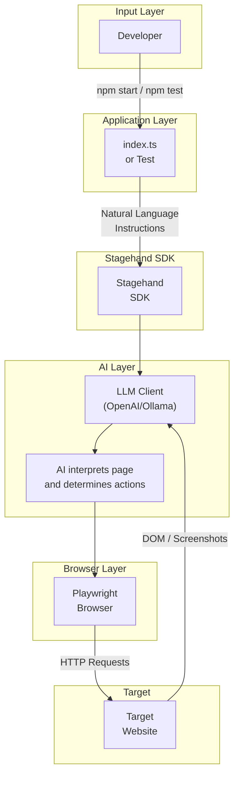

# Architecture

## System Overview

This POC implements an AI-powered browser automation system that combines **Stagehand** (browser automation SDK) with **Large Language Models** (LLMs) to create intelligent web scrapers and testers. The system understands natural language instructions to navigate websites, interact with elements, and extract structured data.

### Goals

1. **Validate Stagehand capabilities** for enterprise automation use cases
2. **Demonstrate AI-driven navigation** without hardcoded selectors
3. **Produce auditable reports** with screenshots and extracted data
4. **Establish testing patterns** for AI-assisted E2E testing

## Components

### Core Components

| Component | File | Responsibility |
|-----------|------|----------------|
| **Main Script** | `index.ts` | Entry point for standalone automation execution |
| **Test Suite** | `tests/stagehand.spec.ts` | Playwright-integrated test scenarios |
| **Playwright Config** | `playwright.config.ts` | Test runner configuration and artifacts |

### External Dependencies

| Dependency | Purpose |
|------------|---------|
| `@browserbasehq/stagehand` | AI-powered browser automation SDK |
| `@playwright/test` | E2E testing framework and browser control |
| `openai` | LLM client for AI reasoning |
| `dotenv` | Environment variable management |

## Data Flow



### Data Flow Steps

1. **Instruction Input**: Developer writes natural language instructions in TypeScript
2. **Stagehand Processing**: SDK interprets instructions and queries LLM for page understanding
3. **LLM Reasoning**: AI analyzes page DOM/screenshot to determine correct element targets
4. **Browser Execution**: Playwright performs the actual browser actions
5. **Data Extraction**: AI extracts requested data and returns structured responses
6. **Report Generation**: Screenshots and extracted data compiled into markdown reports

## Runtime and Deployment

### Environment Modes

| Mode | Configuration | Use Case |
|------|---------------|----------|
| **LOCAL** | `env: "LOCAL"` | Development and testing with local browser |
| **BROWSERBASE** | `env: "BROWSERBASE"` | Cloud-hosted browser execution |

### LLM Configuration

The project uses a custom OpenAI client configured to work with local LLM servers (Ollama):

```typescript
llmClient: new CustomOpenAIClient({
  modelName: "gpt-oss:20b-cloud",
  client: new OpenAI({
    apiKey: process.env.OLLAMA_API_KEY ?? "ollama",
    baseURL: process.env.OLLAMA_API_BASE ?? "http://localhost:11434/v1",
  }),
})
```

### Environment Variables

| Variable | Description | Default |
|----------|-------------|---------|
| `OLLAMA_API_KEY` | API key for LLM service | `"ollama"` |
| `OLLAMA_API_BASE` | Base URL for LLM API | `http://localhost:11434/v1` |

### Build and Execution

```bash
# Build TypeScript
npm run build

# Run main script
npm start

# Run tests
npm test

# View HTML test report
npm run test:report
```

### Output Artifacts

| Artifact | Location | Generated By |
|----------|----------|--------------|
| Test Reports | `playwright-report/` | Playwright test runner |
| Screenshots | `reports/run-{timestamp}/` | Main script execution |
| Execution Reports | `reports/run-{timestamp}/report.md` | Main script |
| Videos | `test-results/` | Playwright (on failure) |

## Dependencies

### Production Dependencies

| Package | Version | Purpose |
|---------|---------|---------|
| `@browserbasehq/stagehand` | ^3.0.8 | Core automation SDK with AI capabilities |
| `dotenv` | ^16.4.7 | Load environment variables from `.env` files |
| `openai` | ^4.87.0 | OpenAI-compatible LLM client |

### Development Dependencies

| Package | Version | Purpose |
|---------|---------|---------|
| `@playwright/test` | ^1.55.0 | E2E testing framework |
| `tsx` | ^4.19.2 | TypeScript execution without compilation |
| `typescript` | ^5.0.0 | TypeScript compiler |

### Why These Dependencies?

- **Stagehand**: Enables natural language browser automation, reducing brittle CSS/XPath selectors
- **Playwright**: Industry-standard browser automation with excellent debugging tools
- **OpenAI Client**: Provides compatibility with OpenAI API and local alternatives (Ollama)
- **tsx**: Allows running TypeScript directly without build step during development

## Key Decisions

### 1. Natural Language Over Selectors

**Decision**: Use AI-interpreted instructions instead of CSS/XPath selectors

**Rationale**:
- Reduces maintenance when UI changes
- More readable and business-aligned test descriptions
- Enables non-technical stakeholders to understand automation logic

**Trade-off**: Execution is slower and requires LLM API access

### 2. Local LLM Support

**Decision**: Configure OpenAI client to support local LLM servers (Ollama)

**Rationale**:
- Reduces API costs during development
- Enables offline development and testing
- Supports air-gapped enterprise environments

**Trade-off**: Local models may have lower accuracy than cloud-hosted alternatives

### 3. Hybrid Testing Approach

**Decision**: Combine Stagehand AI actions with Playwright assertions

**Rationale**:
- Leverages AI for flexible element targeting
- Uses deterministic Playwright assertions for reliability
- Produces standard test reports compatible with CI/CD tools

**Trade-off**: Test complexity increases with two abstraction layers

### 4. Report Generation with Screenshots

**Decision**: Capture screenshots at each navigation step

**Rationale**:
- Provides visual evidence of automation execution
- Helps debug failures by showing actual page state
- Creates documentation artifacts automatically

**Trade-off**: Increases storage requirements and execution time

### 5. Modular Test Helpers

**Decision**: Implement reusable helper functions (`actWithRetry`, `safeAct`, `expectExtractContains`)

**Rationale**:
- Handles flaky AI responses with retry logic
- Standardizes error handling and artifact attachment
- Reduces test code duplication

**Trade-off**: Additional abstraction layer to maintain
