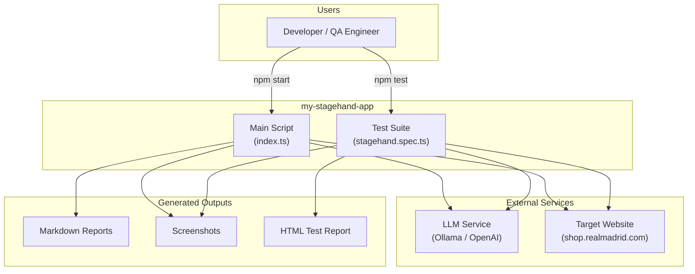
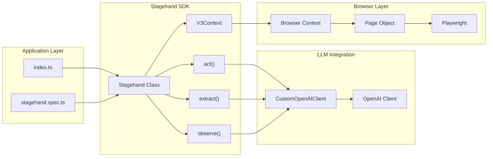
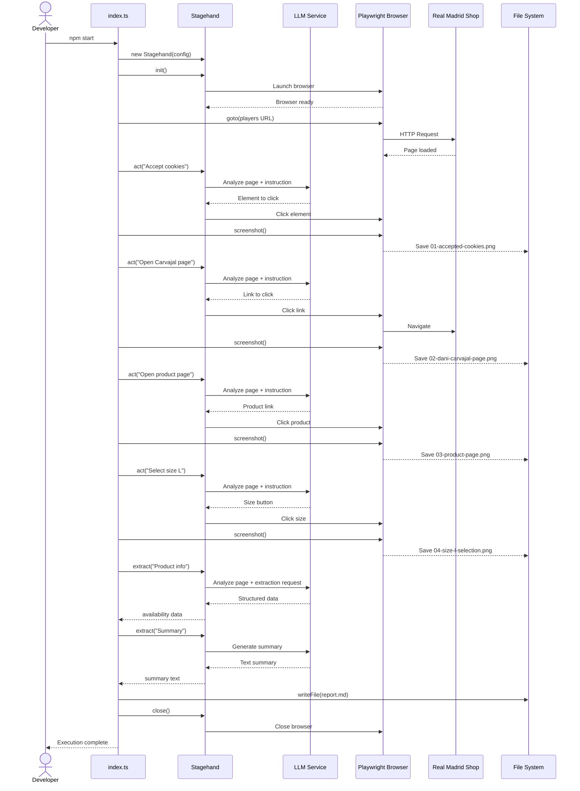
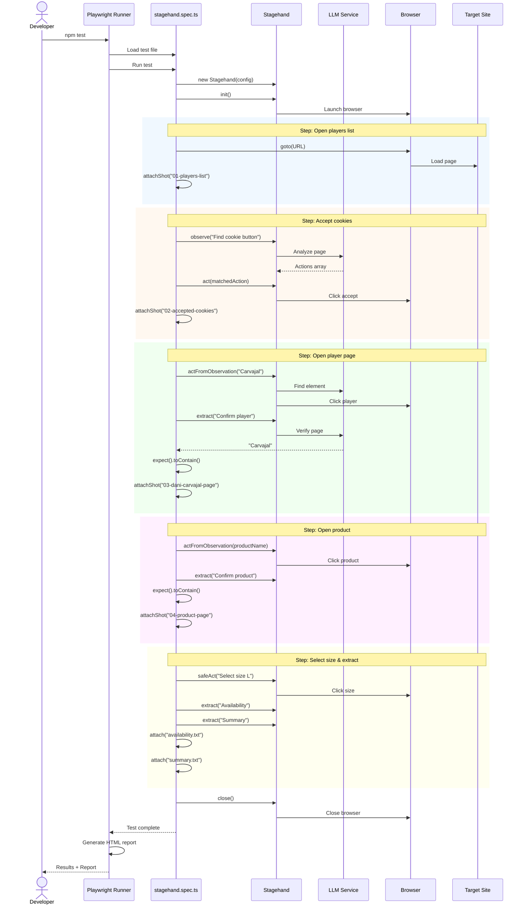
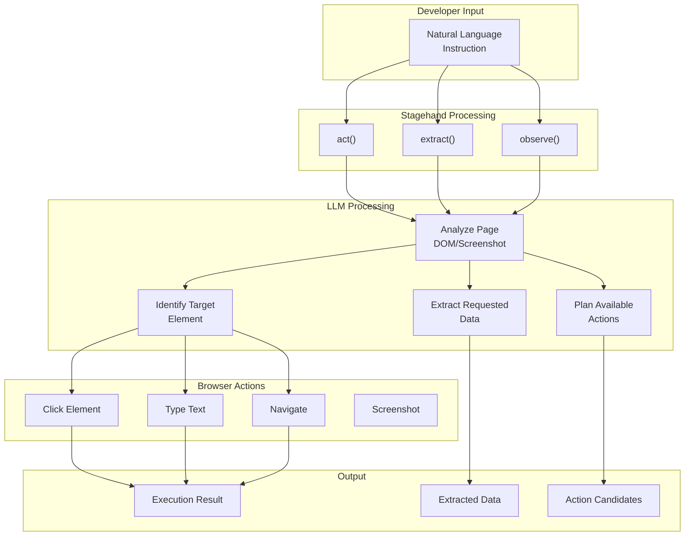
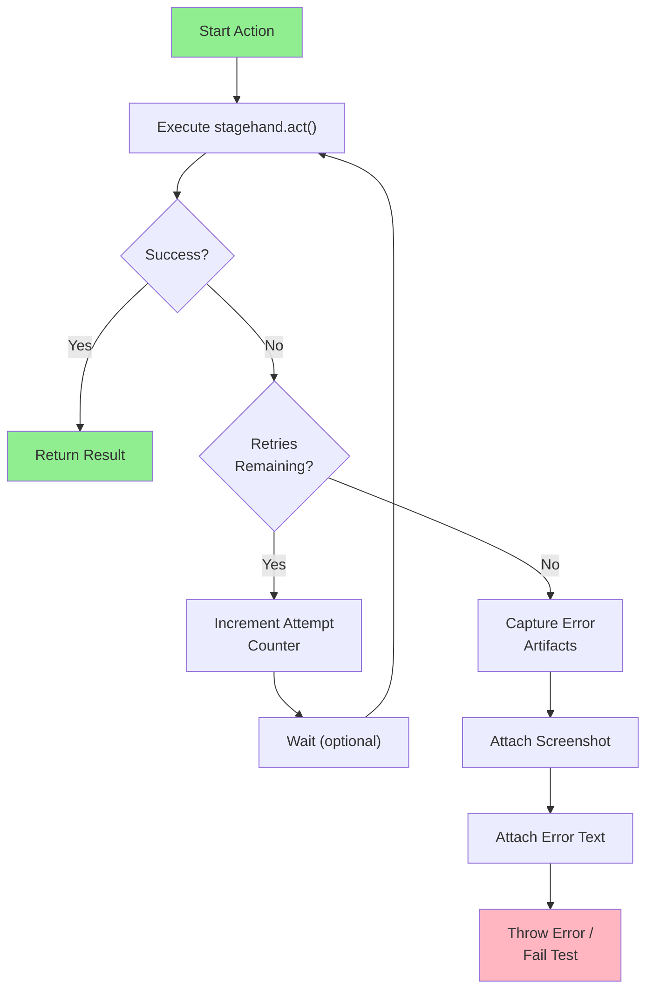
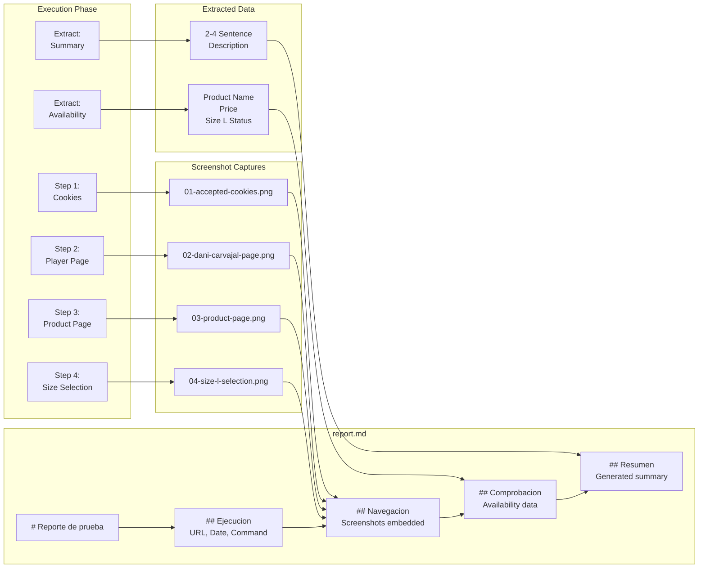
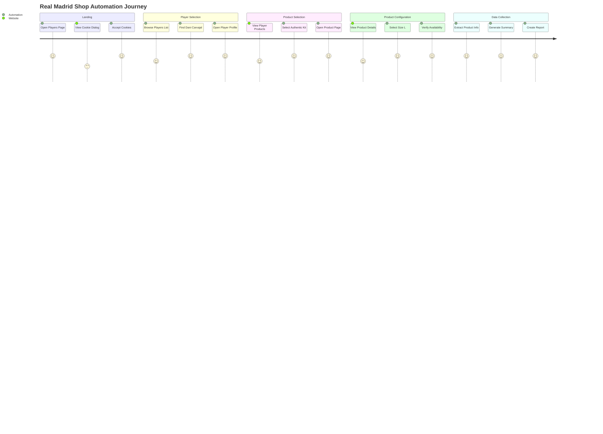
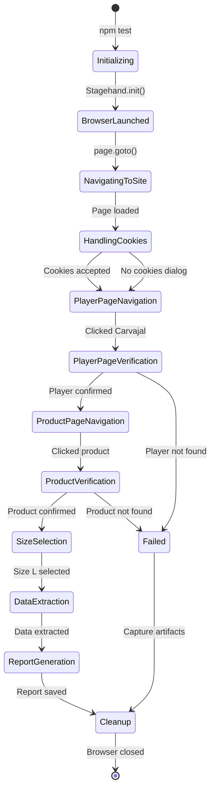
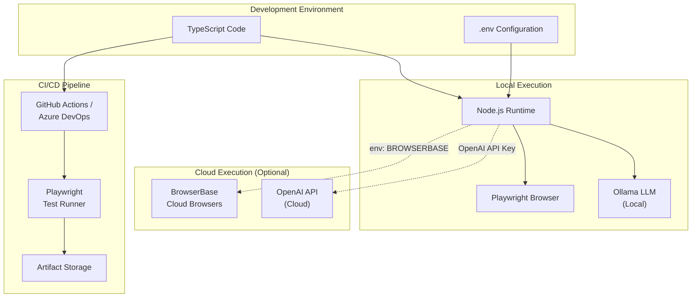

# Diagrams

## System Context

Overview of how the POC system interacts with external components.

## Component Diagram

Internal structure and relationships between components.

## Main Execution Flow

Sequence diagram for the main script (`npm start`).

## Test Execution Flow

Sequence diagram for Playwright test execution (`npm test`).

## Stagehand Method Flow

How Stagehand methods interact with the LLM and browser.

## Error Handling Flow

How errors are handled with retry logic.

## Report Generation Flow

How the markdown report is assembled.

## User Journey: E-Commerce Navigation

Visual representation of the automated user journey on the Real Madrid shop.

## State Diagram: Test Execution States

## Deployment Architecture

